# CloudFaster Academy: Demonstração de utilização do S3 + CloudFront + API Gateway

> **Autor:** [CloudFaster Tecnologia](https://cloudfaster.com.br), **Última revisão:** 25/10/2022

## Introdução

Nesse *lab* iremos aprender como armazenar uma aplicação web no *Amazon S3* de forma segura e distribui-la através de uma CDN com o *Amazon CloudFront*. Nossa aplicação irá fazer uma requisição para o backend solicitando a listagem dos itens gravados no *Amazon DynamoDB* para apresenta-los.\
\
A arquitetura da nossa aplicação será a apresentada abaixo.
\


## Pré-requisitos

1) Uma conta na AWS.
2) Um usuário com permissões suficientes para acessar os recursos necessários (IAM, Lambda, DynamoDB e API Gateway, S3 e CloudFront).
3) Ter realizado todos os passos da "Demonstração de utilização da API Gateway + Lambda + DynamoDB" que pode ser acessado [aqui](https://github.com/cloudfaster-academy-workshop/demo-lambda-dynamodb).

> **Importante:** Estamos assumindo que os passos necessários para criação da IAM Role já foram realizados seguindo o tutorial da ["Demonstração de utilização da API Gateway + Lambda + DynamoDB"](https://github.com/cloudfaster-academy-workshop/demo-lambda-dynamodb), caso contrário, sugerimos acessar o link e realizar essa demonstração primeiro.

## Passo 1: Criar a função Lambda que irá ler o conteúdo do DynamoDB

Após acessar sua conta AWS, navegue até o serviço "Lambda" ou acesse diretamente por esse link: <https://console.aws.amazon.com/lambda>.\
\
Crie uma nova função Lambda clicando no botão *"Create function"* na tela de listagem dos lambdas diponíveis.\
\
Na tela seguinte, mantenha a opção *"Author from scratch"* selecionada, informe um nome para sua função, para nosso exemplo utilizaremos `lambda-read-dynamodb`, em seguida escolha um *Runtime* e a arquitetura que você quer que seu código seja executado, para esse exemplo utilizaremos Python 3.9 em uma arquitetura x86_64.\
\
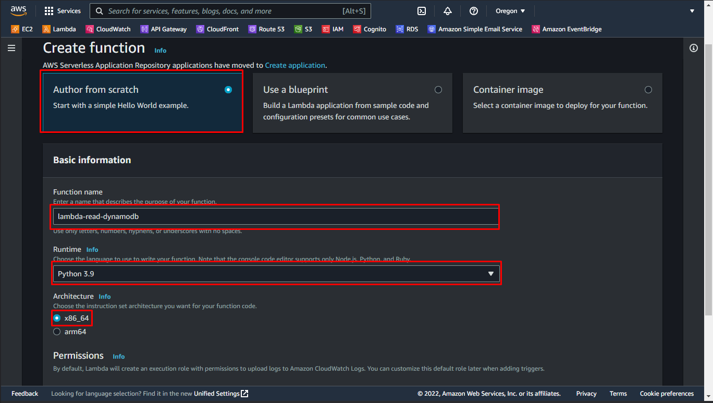
\
\
Role a tela um pouco para baixo e abra as opões presentes em *"Change default execution role"*, marque a opção *"Use an existing role"* e no campo *"Existing role"* selecione a Role IAM criada no passo 1 da ["Demonstração de utilização da API Gateway + Lambda + DynamoDB"](https://github.com/cloudfaster-academy-workshop/demo-lambda-dynamodb#passo-1-criar-uma-role-do-iam), em seguida, clique em *"Create Function"*.\
\


Sua função Lamda será criada e será possível editar o código diretamente no *Browser*.\
\
Apague o conteúdo do arquivo "lambda_function.py" aberto no editor de código da função Lambda, copie todo o conteúdo do arquivo [`backend/lambda-read-dynamodb.py`](https://github.com/cloudfaster-academy-workshop/demo-s3-cloudfront-apigateway/blob/main/backend/lamda-read-dynamodb.py), disponível neste repositório, e cole no editor de código da função Lambda.\
\
Em seguida substitua as variáveis `DYNAMODB_TABLE` e `AWS_REGION` (linhas 13 e 15 do código) com os valores corretos para sua tabela do DynamoDB criado no passo 2 da ["Demonstração de utilização da API Gateway + Lambda + DynamoDB"](https://github.com/cloudfaster-academy-workshop/demo-lambda-dynamodb#passo-2-criar-a-tabela-no-dynamodb).\
\
Ao finalizar clique em *"Deploy"*.\
\
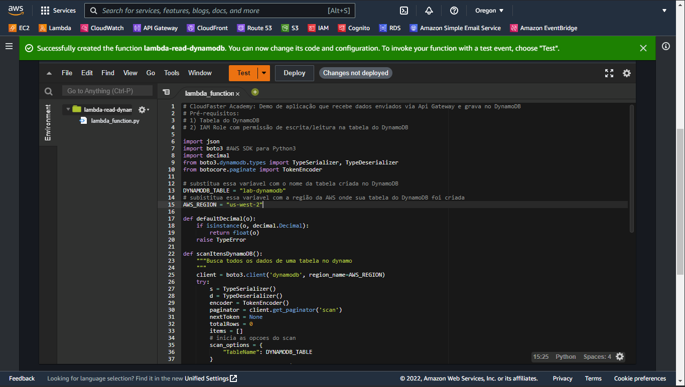
\
\
Agora iremos testar nossa nova função Lambda, clique em *"Test"*. Será aberta uma tela de configuração do evento, nele iremos informar um nome para nosso teste e o JSON que será recebido como evento. Como nossa função irá ler o conteúdo do banco e não precisa de nenhuma informação de entrada, iremos criar um JSON vazio.

```json
{}
```

Ao finalizar, clique em *"Save"*\
\

\
\
Assim que o novo evento de teste for criado, você poderá rodar sua função Lambda para teste, basta clicar no botão *"Test"*.\
\
Tudo ocorrendo bem você verá uma mensagem de sucesso, conforme imagem abaixo:\
\
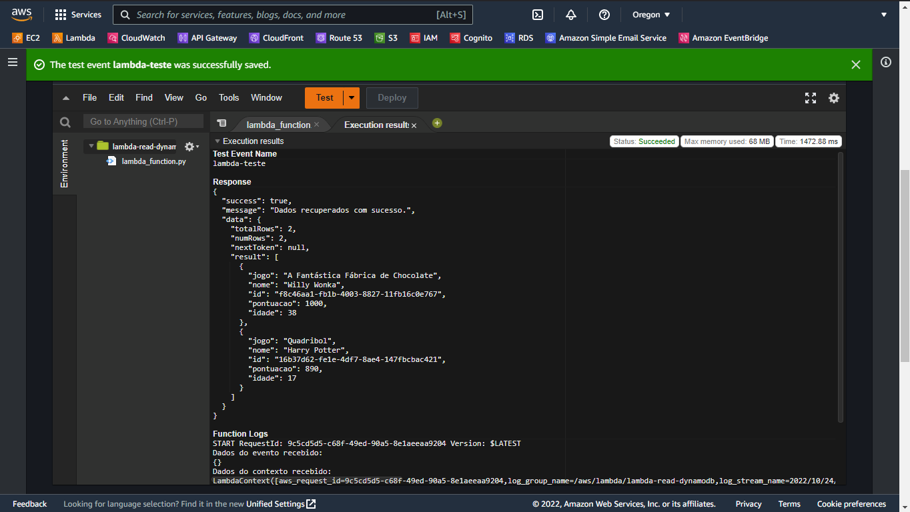

## Passo 2: Criar o vínculo do Lambda com a API Gateway

Após acessar sua conta AWS, navegue até o serviço "API Gateway" ou acesse diretamente por esse link: <https://console.aws.amazon.com/apigateway>.\
\
Será listada as APIs criadas para sua conta, clique na API que criamos no passo 4 da [Demonstração de utilização da API Gateway + Lambda + DynamoDB](https://github.com/cloudfaster-academy-workshop/demo-lambda-dynamodb#passo-4-criar-o-vinculo-do-lambda-com-a-api-gateway).\
\

\
\
Na próxima tela, clique em *"Actions" > "Create Method"* aparecerá um campo seletor, selecione o método GET e clique no simbolo de "check".\
\
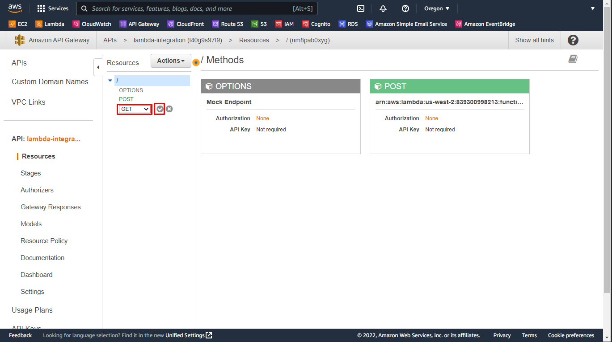
\
\
Configure seu Lambda criado no passo 1 como integração da API Gateway, marcando o tipo de integração como *"Lambda Function"*, selecione a região onde seu Lambda foi criado e informe o nome da função Lambda criada, em seguida clique em "*Save*".\
\

\
\
Um pop-up de verificação aparecerá perguntando se você tem certeza que deseja dar permissão para a API Gateway de invocar a Função Lambda, clique em *"OK"*.\
Após criado o método, vamos configurar o CORS da API, nesse caso vamos liberar o CORS para qualquer origem, basta acessar o botão *"Actions"* e em seguida *"Enable CORS"*.\
\
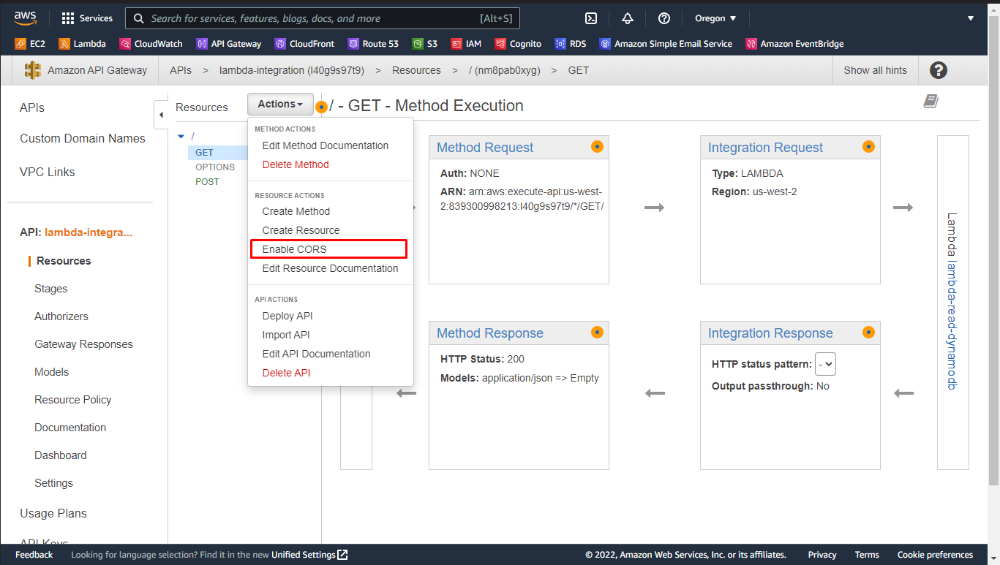
\
\
Na próxima tela, revise dos dados da configuração do CORS e clique em *"Enable CORS and replace existign CORS headers"*.\
\
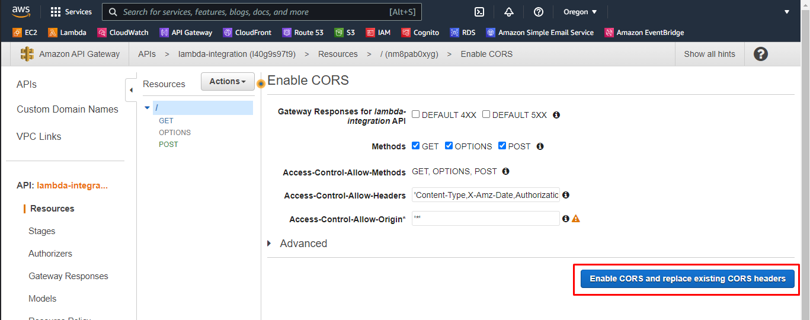
\
\
Um pop-up surgirá para confirmar as alterações, clique em *"Yes, replace existing values"*.\
\
Finalizado essa parte, nossa API já está pronta para ser implantada, para isso vamos acessar novamente o botão *"Actions"* e em seguida *"Deploy API"*, um pop-up com os detalhes da implantação irá aparecer, selecione o estágio da API que criamos na [Demonstração de utilização da API Gateway + Lambda + DynamoDB](https://github.com/cloudfaster-academy-workshop/demo-lambda-dynamodb#passo-4-criar-o-vinculo-do-lambda-com-a-api-gateway) em seguida clique em *"Deploy"*.\
\
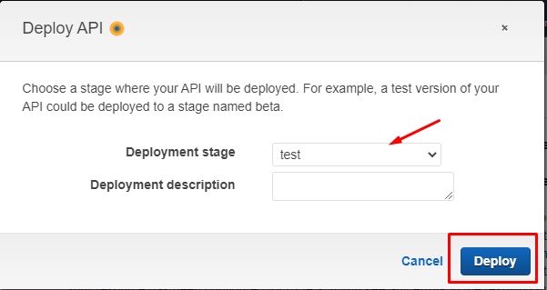
\
\
Pronto, sua API está implantada e pronta para receber as requisições. Em *"Stages"* você consegue visualizar o endpoint que você pode utilizar para suas requisições.\
\
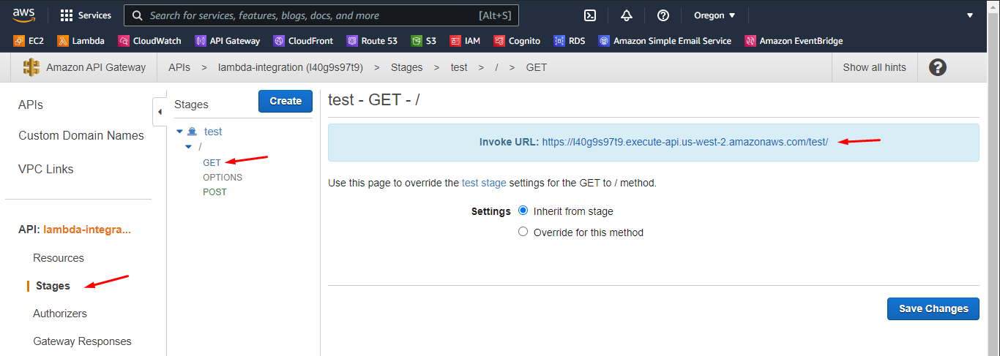
\
\
Para testar, você pode utilizar o PostMan para realizar suas resquisições.\
\
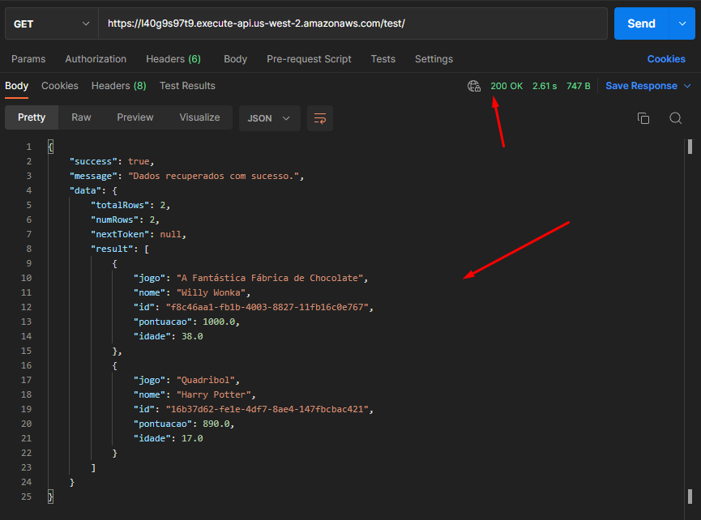

## Passo 3: Subir um Web Site estático para um Bucket S3

Após acessar sua conta AWS, navegue até o serviço "S3" ou acesse diretamente por esse link: <https://s3.console.aws.amazon.com/s3/buckets>.\
\
Serão listados os buckets S3 disponíveis em sua conta AWS, clique no botão *"Create bucket"* para adicionar um novo Bucket S3.\
\
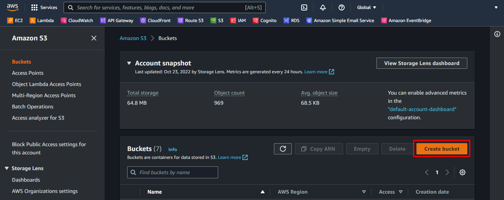
\
\
Na próxima tela, dê um nome para seu Bucket S3 e mantenha as demais configurações conforme recomendado.

> **Atenção:** Os nomes dos Buckets S3 devem ser únicos em toda a nuvem, caso escolha um nome que já exista uma mensagem de erro será apresentada.

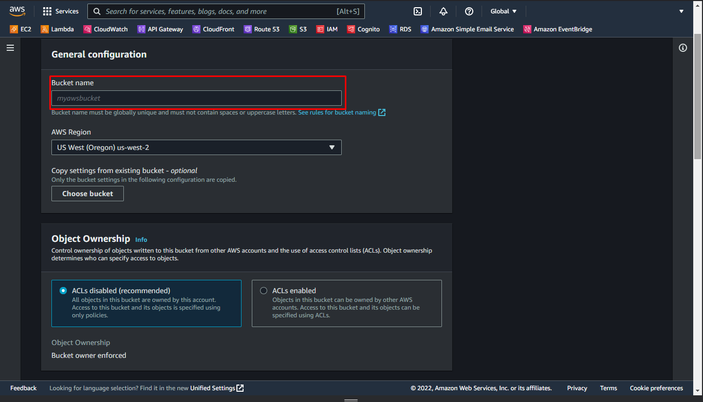
\
\
Para garantir que nossos objetos armazenados no Bucket S3 não sejam públicos, vefifique se a opção *"Block all public access"* está marcada.\
\

\
\
Em seguida clique em *"Create bucket"*.\
\
Antes de adicionarmos nosso conteúdo estático ao Bucket, acesse o diretório `frontend` desse repositório, e edite o arquivo `functions.js`, alterando a variável global `ENDPOINT_URL` (linha 2 do código) com o endpoint criado no passo 2.\
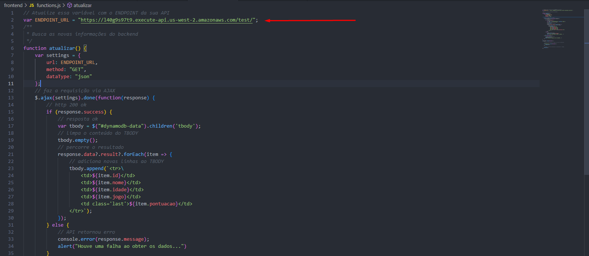
\
\
Ao finalizar a edição, acesse o Bucket recém criado e faça o upload de todos os arquivos que estão no diretório `frontend`.\
\
Abra o Bucket recém criado e na aba *"Objects"* clique em *"Upload"*.\
\
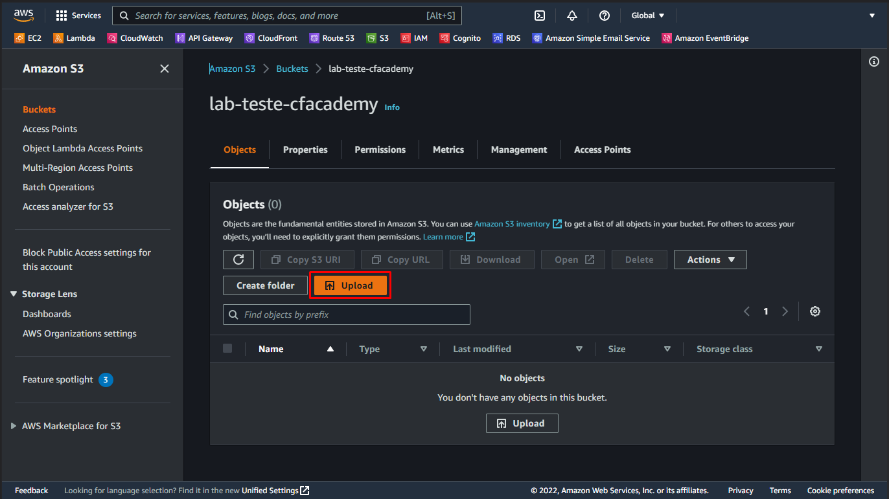
\
\
Na próxima tela, clique no botão *"Add files"*, uma tela para escolher os arquivos que você deseja carregar será aberta, navegue até o diretório que você baixou o conteúdo do diretório `frontend` desse repositório, selecione os 3 arquivos e realize o upload.\
\
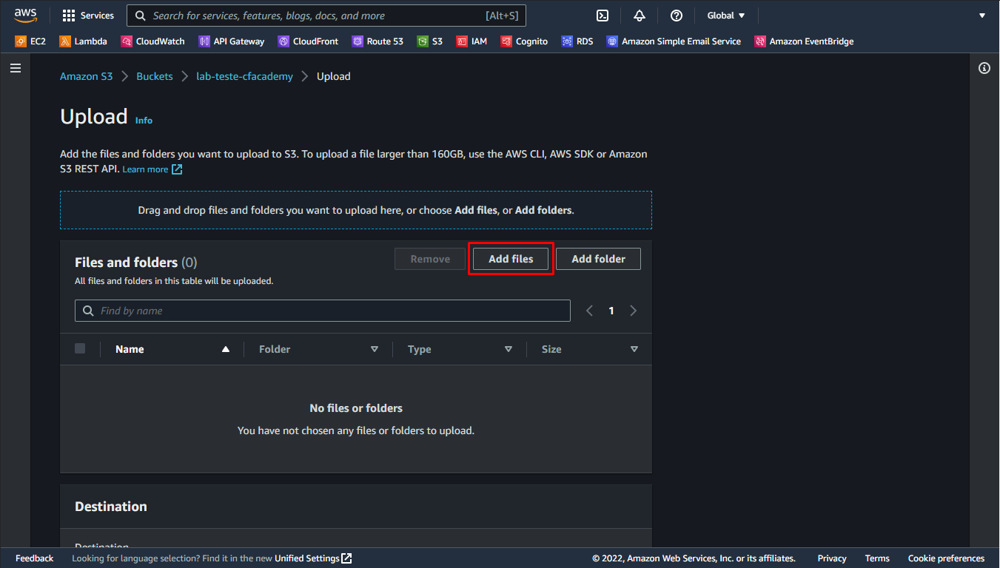
\
\
Uma tela de confirmação será apresentada, confira se os 3 arquivos estão presentes na listagem do campo *"Files and folders"* e em seguida clique em *"Upload"*.\
\
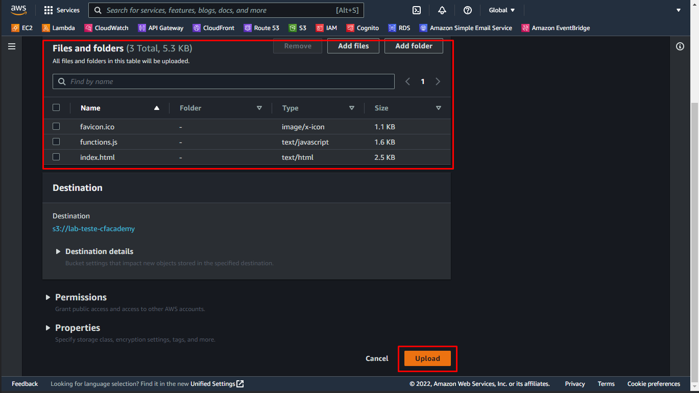
\
\
O upload será realizado e ao finalizar uma tela de sucesso será apresentada.\
\


## Passo 4: Criar uma distribuição CloudFront para distribuir o conteúdo do nosso Bucket S3

Após acessar sua conta AWS, navegue até o serviço "CloudFront" ou acesse diretamente por esse link: <https://console.aws.amazon.com/cloudfront/v3/#/distributions>.\
\
Crie uma nova distribuição clicando no botão *"Create distribution"*.\
\

\
\
Na próxima tela iremos configurar qual será nossa origem dos dados, ou seja, quais dados serão distribuídos pelo CloudFront.\
\
Em *"Orign domain"*, selecione o Bucket S3 criado no passo 3, em Origin path pode manter vazio, o campo *"Name"* será preenchido automaticamente com o nome do Bucket, mantenha o nome ou escolha um de sua preferência.\
\
Em *"Origin access"*, iremos configurar as permissões necessárias para acessar nossos objetos no S3, para isso selecione a opção *"Legacy access identities"*.\
\
Novas opções serão exibidas, em *"Origin access identity"*, clique no botão *"Create new OAI"*, um pop-up será exibido para que você informe um nome, mantenha o nome sugerido ou crie um de sua preferência.\
\
Em *"Bucket policy"*, selecione a opção *"Yes, update the bucket policy"*.\
\
Mantenha os demais campos do grupo *"Origin"* com os valores já definidos.\
\

\
\
Em *"Default cache behavior"*, em *"Viewer protocol policy"*, selecione a opção *"Redirect HTTP to HTTPS"* e mantenha os demais campos com os valores já definidos.\
\
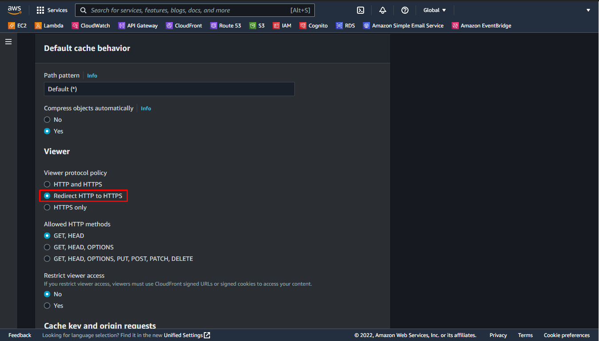
\
\
Em *"Settings"* no campo *"Default root object"*, informe o nome do arquivo que deverá ser o default do diretório root, em nosso caso informe `index.html`. Em seguida clique em *"Create distribution"*.\
\
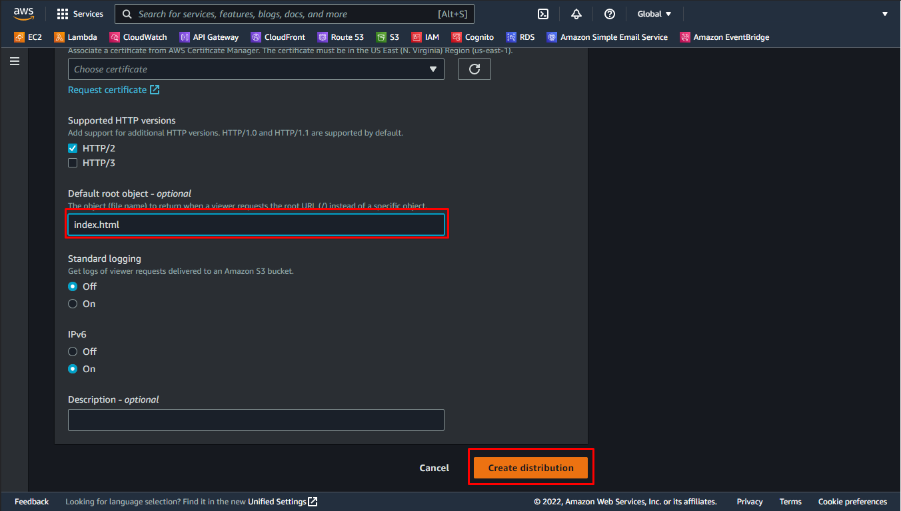
\
\
Ao finalizar, uma tela informando que a distribuição foi criada será exibida, bem como um endereço DNS da distribuição e também informará que a distribuição está sendo implantada.\
Esse processo pode demorar alguns minutos, aguarde até que o processo esteja finalizado.\
\

\
\
Ao finalizar, copie o DNS da distribuição e abra em um browser para ver sua aplicação web sendo distribuida via CloudFront acessando seus objetos privados no S3.\
\
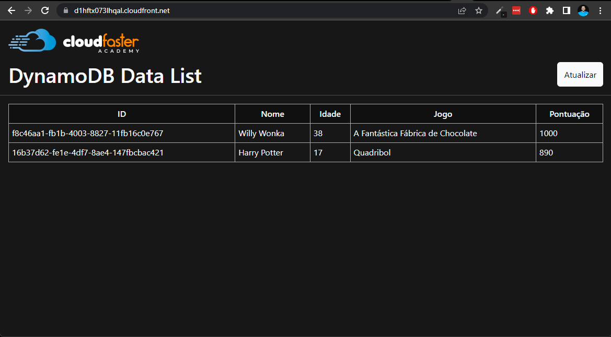
\
\
That's all folks!
